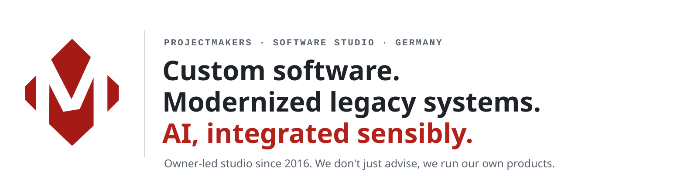
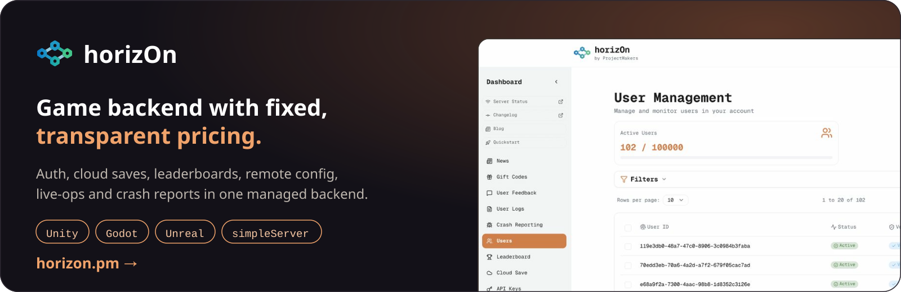
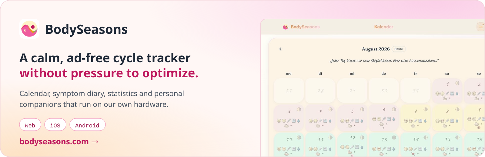
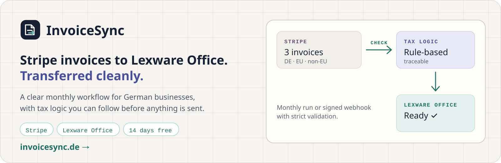

<picture>
  <source media="(prefers-color-scheme: dark)" srcset="media/readme/hero-dark.svg">
  
</picture>

  <a href="https://projectmakers.de/en/services/software-development">Custom software</a> ·
  <a href="https://projectmakers.de/en/services/legacy-modernization">Legacy modernization</a> ·
  <a href="https://projectmakers.de/en/services/ai-solutions">AI and automation</a> ·
  <a href="https://projectmakers.de/en/contact"><b>Talk to us</b></a>

## Products we run

We build these products ourselves and operate them in production. They are the best reference we can give you.

## Open source and free tools

<table>
<tr>
<td width="50%" valign="top">

**For AI coding agents**

- [ai-agent-wiki](https://github.com/ProjectMakersDE/ai-agent-wiki): a wiki your agents read before they work
- [horizOn-mcp](https://github.com/ProjectMakersDE/horizOn-mcp): horizOn docs and live API tools over MCP

**For game developers**

- horizOn SDK for [Unity](https://github.com/ProjectMakersDE/horizOn-SDK-Unity), [Godot](https://github.com/ProjectMakersDE/horizOn-SDK-Godot) and [Unreal](https://github.com/ProjectMakersDE/horizOn-SDK-Unreal)
- [horizOn-simpleServer](https://github.com/ProjectMakersDE/horizOn-simpleServer): self-hostable PHP game backend
- [Unity-PmPrefs](https://github.com/ProjectMakersDE/Unity-PmPrefs) and [Unity-AutoSave](https://github.com/ProjectMakersDE/Unity-AutoSave): small Unity editor tools
- [YouTube-Tutorials](https://github.com/ProjectMakersDE/YouTube-Tutorials): the Unity project of our German video series

</td>
<td width="50%" valign="top">

**For your Mac**

- [STTBar](https://github.com/ProjectMakersDE/STTBar): dictation in the menu bar, talk instead of type (free, source available)
- [MacZones](https://github.com/ProjectMakersDE/MacZones): window zones, close to 0 % CPU when idle

**For servers**

- [EasySSHTunnelManager](https://github.com/ProjectMakersDE/EasySSHTunnelManager): SSH tunnels in a small Linux app
- [wp-health-endpoint](https://github.com/ProjectMakersDE/wp-health-endpoint): health endpoint for WordPress

**Guides**

- [legacy-software-abloesen](https://github.com/ProjectMakersDE/legacy-software-abloesen): replacing legacy software feature by feature (German)

</td>
</tr>
</table>

## Work with us

Owner-led studio from Immenhausen, Germany, since 2016. We work remotely with companies in German or English, from the first concept to stable operation.

[Website](https://projectmakers.de/en) · [horizOn changelog](https://github.com/ProjectMakersDE/horizOn-Changelog) · [Imprint](https://projectmakers.de/imprint)
